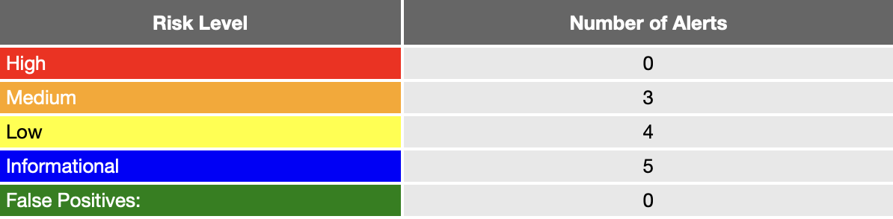
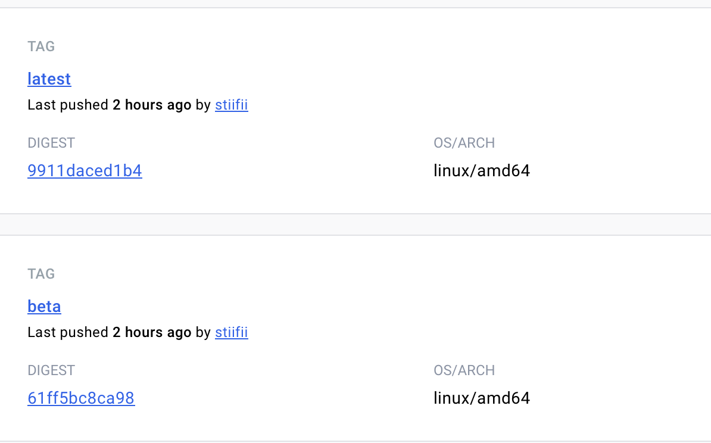

[](https://github.com/stiifii/tbo_projekt/actions/workflows/dependency_check.yml)
[](https://github.com/stiifii/tbo_projekt/actions/workflows/bandit.yml)
[](https://github.com/stiifii/tbo_projekt/actions/workflows/unit-tests.yml)
[](https://github.com/stiifii/tbo_projekt/actions/workflows/zap.yml)
# TBO - Projekt
Autorzy: 
- Michał Adrjan
- Hubert Decyusz
- Daniel Stefański
## CICD
Do stowrzenia CICD przy użyciu GitHub Actions zostały użyte narzędzia:
- SAST - [Bandit](https://github.com/PyCQA/bandit)
- DAST - [ZAProxy](https://github.com/zaproxy/zaproxy)
- SCA - [Dependency Check](https://github.com/jeremylong/DependencyCheck)

## Komponenty
- [Workflow dla budowy obrazu z gałęzi main z tagiem: latest](.github/workflows/main-build-and-push.yml)
- [Workflow dla budowy obrazu z innej gałęzi z tagiem: beta](.github/workflows/build-and-push.yml)
- [Workflow do uruchomienia SAST Bandit](.github/workflows/bandit.yml)
- [Workflow do uruchomienia ZAP](.github/workflows/zap.yml)
- [Workflow do uruchomienia Dependency Check](.github/workflows/dependency_check.yml)
- [DockerHUB repo](https://hub.docker.com/r/stiifii/tbo_projekt)

- [Workflow do wykonania testów jednostkowych](.github/workflows/unit-tests.yml)
## Zadanie 1
- [X] Gdy nastąpi PUSH do gałęzi main tworzy się nowy image w DockerHub z tagiem latest.
- [X] SCA, SAST oraz DAST zostają uruchomione, gdy zostaje stworzony Pull Request do gałęzi main

## Zadanie 2
Weryfikacja procesu CICD:
### 1. Stworzenie Pull Request: [Pull Request](https://github.com/stiifii/tbo_projekt/pull/6)

### 2. Raport SCA:
Dependency Check wykrył podatność w pakiecie Axios 1.5.1 dla Node.js
[CVE-2023-45857](https://nvd.nist.gov/vuln/detail/CVE-2023-45857)

### 3. Raport SAST:
Bandit wykrył 9 problemów:
- Zaharkodowane hasło w repozytorum:
```python
app.config['SECRET_KEY'] = 'supersecret
``` 

- SQL Injection - brak walidacji dla zmiennej book_name
```python
    vuln = "SELECT * FROM books WHERE name = '"+book_name+""
```

- Pozostałe 7 problemów wynika z użycia assert do wykonania testów jednostkowych. Python usuwa assert, gdy kompiluje kod zoptymalizowanego kodu bajtowego, co może usunąć zabezpieczenia. Powinien zostać podniesiony błąd AssertionError.
```python
    assert book.book_type == 'Fiction'
```

### 4. Raport DAST:


#### High
Brak Content Security Policy (CSP) - whitelistowanie domen, które mogą być wyświetlane na określonej stronie jako źródło np. CSS, JS, czy obrazki. Zapobiega to m.in. atakom XSS.

#### Medium
Związane z poprzednią podatnością, lecz można równiez zapobiec jej poprzez dodanie X-Frame-Options, które zabezpiecza przed atakami typu ClickJacking.

Brak sprawdzenia integralności w blokach ```<script>``` lub ```<link>```, co w przypadku narażenia linku zewnętrznego może wczytać podatny skrypt.

### Docker Hub
W repozytorium [Dockerhub](https://hub.docker.com/r/stiifii/tbo_projekt/tags) zostały stworzone automatycznie dwa obrazy latest oraz beta. 


    
